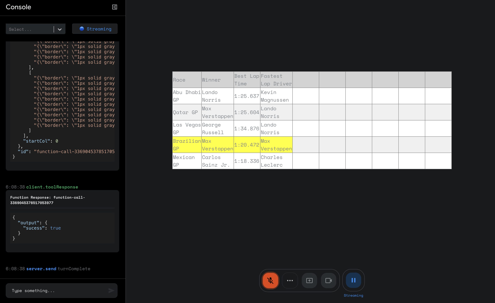

# Multimodal Live API - Web console

This repository contains a react-based starter app for using the [Multimodal Live API]([https://ai.google.dev/gemini-api](https://ai.google.dev/api/multimodal-live)) over a websocket. It provides modules for streaming audio playback, recording user media such as from a microphone, webcam or screen capture as well as a unified log view to aid in development of your application.

Watch the demo of the Multimodal Live API [here](https://www.youtube.com/watch?v=J_q7JY1XxFE).

---

To get started, [create a free Gemini API key](https://aistudio.google.com/apikey). We have provided several example applications on other branches of this repository:

- [demos/GenExplainer](https://github.com/google-gemini/multimodal-live-api-web-console/tree/demos/genexplainer)
- [demos/GenWeather](https://github.com/google-gemini/multimodal-live-api-web-console/tree/demos/genweather)

Below is an example of an entire "Spreadsheet" application in which gemini operates a 10x10 spreadsheet and can fill it up using arbitrary voice (or text) commands. It can use Google Search to fill up cells, and even call Gemini as a tool to perform per-item reasoning (e.g. first enter all recent F1 races, and then for each race, find the winner and the fastest lap time). 

Here is an example matrix iteratively constructed by asking the model about the latest 5 F1 races:

The only application specific code necessary to run this demo is in [this component](src/components/gemini-matrix/GeminiMatrix.tsx).  

## development

This project was bootstrapped with [Create React App](https://github.com/facebook/create-react-app).
Project consists of:

- an Event-emitting websocket-client to ease communication between the websocket and the front-end
- communication layer for processing audio in and out
- a boilerplate view for starting to build your apps and view logs

## Available Scripts

In the project directory, you can run:

### `npm start`

Runs the app in the development mode.\
Open [http://localhost:3000](http://localhost:3000) to view it in the browser.

The page will reload if you make edits.\
You will also see any lint errors in the console.

### `npm run build`

Builds the app for production to the `build` folder.\
It correctly bundles React in production mode and optimizes the build for the best performance.

The build is minified and the filenames include the hashes.\
Your app is ready to be deployed!

See the section about [deployment](https://facebook.github.io/create-react-app/docs/deployment) for more information.
